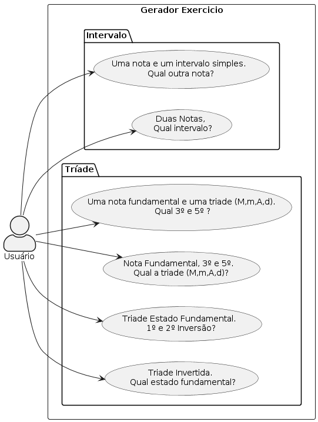
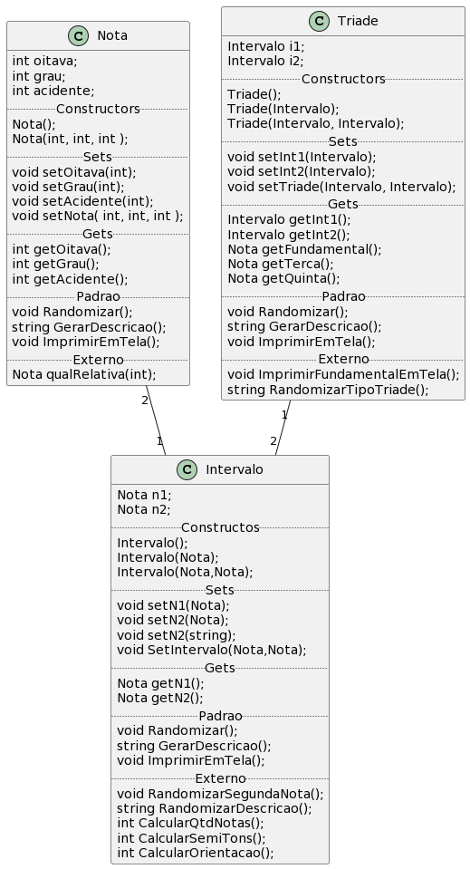

# Motivação 
- Prover aos alunos e profesores da EMUFPA uma solução tecnológica com o intuido de auxiliar o aprendizado dos conteúdos ministrados sobre teoria musical na escola. 

# Possibilidades Funcionais



## Intervalos Simples

- Uníssono
- 2m, 2M
- 3m, 3M
- 4J, 4A
- 5D, 5J
- 6m, 6M
- 7m, 7M
- 8J

## Tríades

- Maior - 3M + 3m
- Menor - 3m + 3M
- Aumentado - 3M + 3M
- Diminuto - 3m + 3m

# Funcionalidades
## Primerio Grupo
- Intervalos 
- Triades
- Opção de Dificuldade
  - Facil - randomizar notas sem acidentes
  - medio - randomizar notas com até 1 acidente (b ou #)
  - dificil - randomizar notas com até 2 acidente (bb ou *)
- Interação; com repecção de resposta, correção e avaliação

## Segundo Grupo
- Inversões de Triades
- Tétrades e suas inversões
- Cifras
  - Campo Harmônico Maior
  - Campo Harmônico Menor (Primitiva, Harmônica e Melódica)
- Intervalos Compostos

# Etapa de Desenvolvimento

1. Assegurar viabilidade do primeiro grupo de funcionalidades ainda em modo texto.
1. Determinar a forma de a solução/aplicação será "entrege" 
   1. Aplicação Desktop
   1. Aplicação Web
   1. Aplicação Mobile
1. Implementar o segundo grupo de funcionalidedes.
____
# Class Diagram



```                           
                                            ,---------------------------------.
,----------------------------------------.  |Triade                           |
|Nota                                    |  |---------------------------------|
|----------------------------------------|  |Triade();                        |
|Nota();                                 |  |Triade(Intervalo);               |
|Nota(int, int, int );                   |  |Triade(Intervalo, Intervalo);    |
|void setOitava(int);                    |  |void setInt1(Intervalo);         |
|void setGrau(int);                      |  |Intervalo getInt1();             |
|void setAcidente(int);                  |  |void setInt2(Intervalo);         |
|int getOitava();                        |  |Intervalo getInt2();             |
|int getGrau();                          |  |Nota getFundamental();           |
|int getAcidente();                      |  |Nota getTerca();                 |
|void setNota( int, int, int );          |  |Nota getQuinta();                |
|void RandomizarNota();                  |  |void ImprimirEmTela();           |
|Nota qualRelativa(int);                 |  |void ImprimirFundamentalEmTela();|
|string GerarDescricao();                |  |string GerarDescricao();         |
|void ImprimirEmTela();                  |  |string RandomizarTipoTriade();   |
|int oitava;     // 0--8                 |  |void RandomizarTriade();         |
|int grau;       // 1--7                 |  |Intervalo i1;                    |
|int acidente;   // [-2,0,2] [bb,b,0,#,*]|  |Intervalo i2;                    |
`----------------------------------------'  `---------------------------------'
                                                                               
                                                                               
                      ,------------------------------------.                   
                      |Intervalo                           |                   
                      |------------------------------------|                   
                      |Intervalo();                        |                   
                      |Intervalo(Nota);                    |                   
                      |Intervalo(Nota,Nota);               |                   
                      |void setN1(Nota);                   |                   
                      |void setN2(Nota);                   |                   
                      |void setN2(string);                 |                   
                      |void setN2();                       |                   
                      |void setQtdNotasNaturais(int);      |                   
                      |void setQtdSemiTons(int);           |                   
                      |Nota getN1();                       |                   
                      |Nota getN2();                       |                   
                      |int  getQtdNotasNaturais();         |                   
                      |int  GetQtdSemiTons();              |                   
                      |void SetIntervalo(Nota,Nota);       |                   
                      |void CalcularAtributosSecundarios();|                   
                      |void RandomizarSegundaNota();       |                   
                      |string RandomizarDescricao();       |                   
                      |string GerarDescricao();            |                   
                      |void ImprimirEmTela();              |                   
                      |Nota n1;                            |                   
                      |Nota n2;                            |                   
                      |int qtdNotasNaturais; //[2-7]       |                   
                      |int qtdSemiTons;     //[2-12]       |                   
                      |int orientacao; //[-1 desc, 1 asc]  |                   
                      `------------------------------------'                   
